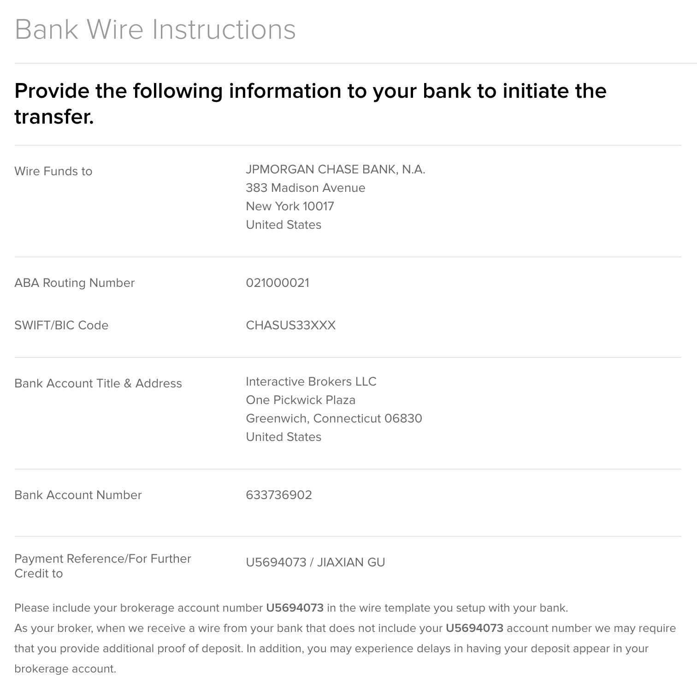

# 汇款说明
### 这是一个汇款的详细说明
### 每次汇款前请参照以下说明
### 一共有两种汇款选择：
- 汇美元
    - 从中国的银行汇出美元，汇往专门的股票账户，用于股票投资。
    - 股票账户可能每次都会有变化，详情请看下图.
- 汇日元
    - 从中国的银行汇出日元，汇往日本的银行的现金账户，用于生活花费。
    - 日本银行的现金账户一般固定，
## 汇美元的汇款地址和注意事项
- 汇往下图中的账户。  
  

- 从上图内容中寻找对应信息填入中国的银行提供的汇款单中。
- 上图中最后一项: Payment Reference/For Further Credit to 一定要在汇款单上填写。这项信息将告诉券商这笔钱是给谁的。如无此项信息券商将无法确认此笔汇款的实际接收客户。一般填写在如下图中所示“汇款附言”的地方。（信息已被遮挡，遮挡部分在微信群查看）  
  

## 汇日元的汇款地址和注意事项
- 汇款地址如下：  

Bank Name（收款人银行名）:  
SHINSEI BANK, LTD.

SWIFT（收款人银行的SWIFT识别编码）:  
LTCBJPJT-(HED)

Branch Name（收款人银行的分行/支店名）:  
HEAD OFFICE

Beneficiary Bank Address（收款人银行的地址）:  
2-4-3, NIHONBASHI-MUROMACHI, CHUO-KU, TOKYO, JAPAN

Beneficiary Name（收款人名）:  
（该信息在微信群查看）

Beneficiary Address（收款人地址）:  
（该信息在微信群查看）

Beneficiary Branch Number and Account Number（收款人账号，如有填写银行分店号则单独填写开头的400，如无则填写下面整串数字）:  
（该信息在微信群查看）

remarks（此项一般不会用到。此项用于汇款日元以外的货币时让接收银行不要换汇）:  
DO NOT CONVERT

