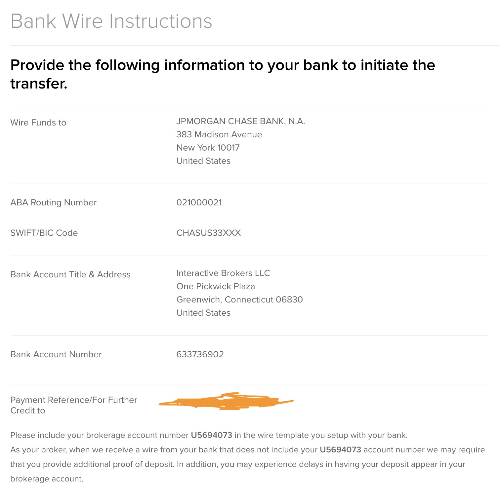

### 这是一个汇款的详细说明
### 每次汇款前请参照以下说明
### 一共有两种汇款选择：
- 汇美元
    - 从中国的银行汇出美元，汇往专门的股票账户，用于股票投资。
    - 股票账户可能每次都会有变化，详情请看下图.
- 汇日元
    - 从中国的银行汇出日元，汇往日本的银行的现金账户，用于生活花费。
    - 日本银行的现金账户一般固定，
## 汇美元的汇款地址和注意事项
- 汇往下图中的账户。  
 
